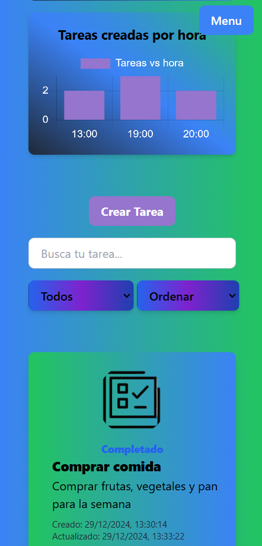

# TaskManager

## Deploy

- **Frontend**
  [TaskManager Frontend](https://taskmanager-amber-nine.vercel.app/)

- **Backend**
  [TaskManager Backend API](https://taskmanager-kdhq.onrender.com/api)

## Description

TaskManager is a full-stack task management application designed for users to create, update, and manage their tasks effectively. It is built with the following technologies:

### Frontend:

- **React**: For building an interactive and dynamic user interface.
- **Vite**: For a fast and modern development experience.
- **Redux**: For state management across the application.
- **TailwindCSS**: For sleek and responsive UI styling.

### Backend:

- **Node.js & Express**: To create a robust and scalable REST API.
- **TypeScript**: For type-safe and maintainable development.
- **MongoDB & Mongoose**: For database management and schema modeling.
- **JWT (JSON Web Tokens)**: For secure authentication and authorization.
- **Swagger**: For API documentation.

---

## How to Set Up and Run the Application

To set up and run the application locally, follow these steps:

1. **Clone the Repository** Clone the repository to your local machine:

   git clone https://github.com/jorge210488/taskmanager.git

2. **Go to the taskmanager directory**

- cd taskmanager

3. **Navigate to both the backend and frontend directories and install the required dependencies**

- cd backend
- npm install
- cd ../frontend
- npm install

4. **Set Up Environment Variables** Create a .env file in both the backend and frontend directories. Use the .env.example file in each directory as a guide for the required variables.

- **Backend**
- PORT=app_port
- MONGO_URI=MongoDB_URI
- JWT_SECRET=jwtsecretpassword

- **Frontend**
- VITE_BACKEND_URL=Backend_URL

5. **Build the application** Build the Frontend and backend

- cd frontend
- npm run build
- cd backend
- npm run build

6. **Run the application**

- cd frontend
- npm run dev
- cd backend
- npm run start:dev

## Application Walkthrough

### Home Page

When you first open the application, you will land on the **Home Page**. This page introduces the application and provides a welcoming user interface.

To start using TaskManager, you need to **register** or **log in** using the menu located at the top-right corner. Once logged in, you will be automatically redirected to the **Tasks Page**.

### Tasks Page

This is the main page where you can manage your tasks. It consists of three primary sections:

1. **Dashboard**:  
   At the top of the page, you will find a dashboard with charts displaying the current statistics of your tasks. This includes:

   - Total number of tasks.
   - Breakdown of completed and pending tasks.
   - A chart showing tasks created by hour.

2. **Control Menu**:  
   Below the dashboard, you'll see a control menu with the following features:

   - **Create Task Button**: Opens a modal where you can create a new task.
   - **Search Bar**: Allows you to search for tasks by their title.
   - **Filters**: Dropdown menus to filter tasks by their status (e.g., completed or pending) and sort them by creation date (e.g., newest or oldest).

3. **Task Cards**:  
   The task cards display all tasks belonging to the logged-in user. Each card shows the task's title, description, status (completed or pending), and creation/update dates.
   - Clicking on a task card opens a modal where you can **edit** the task or **update its status**.

This intuitive layout makes managing your tasks simple and efficient.

---
